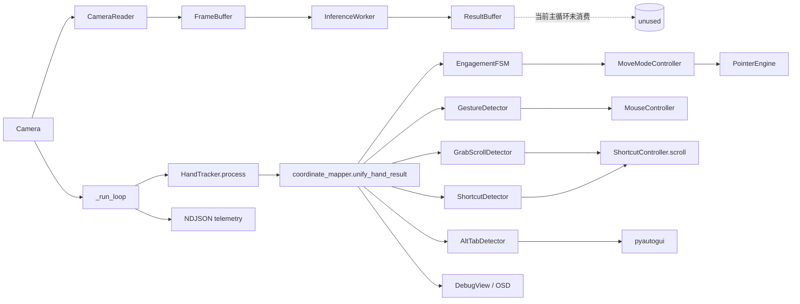
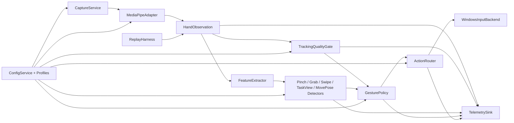
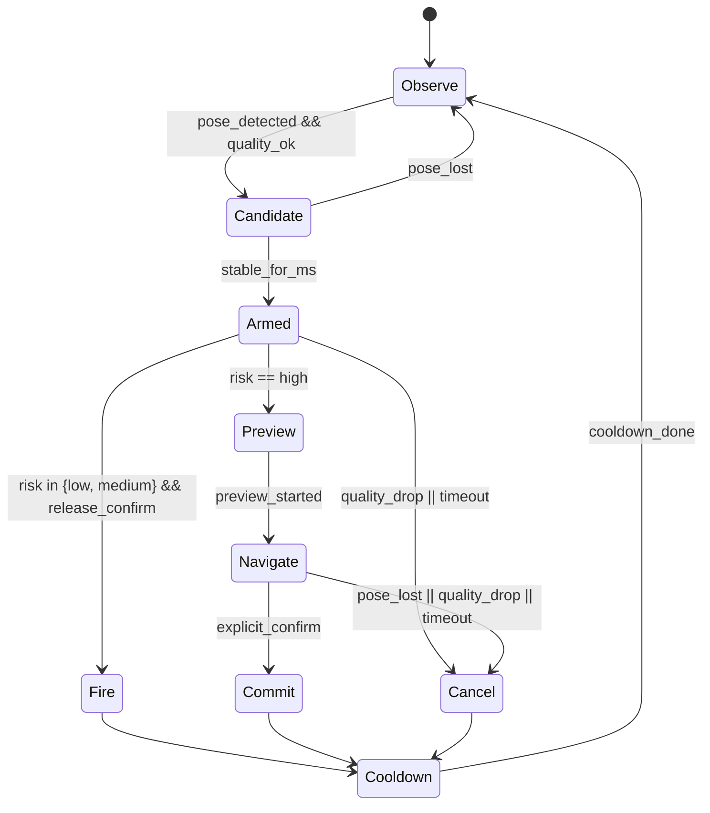
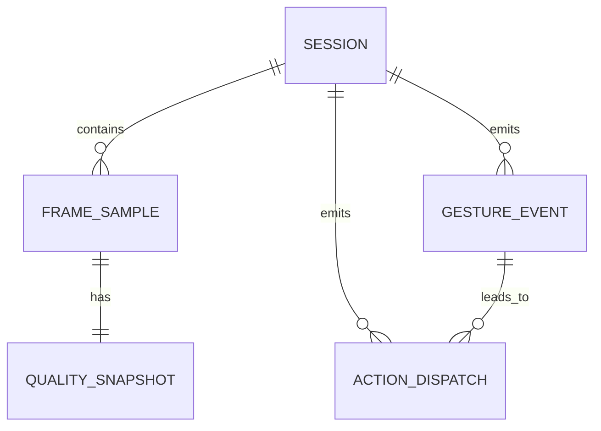
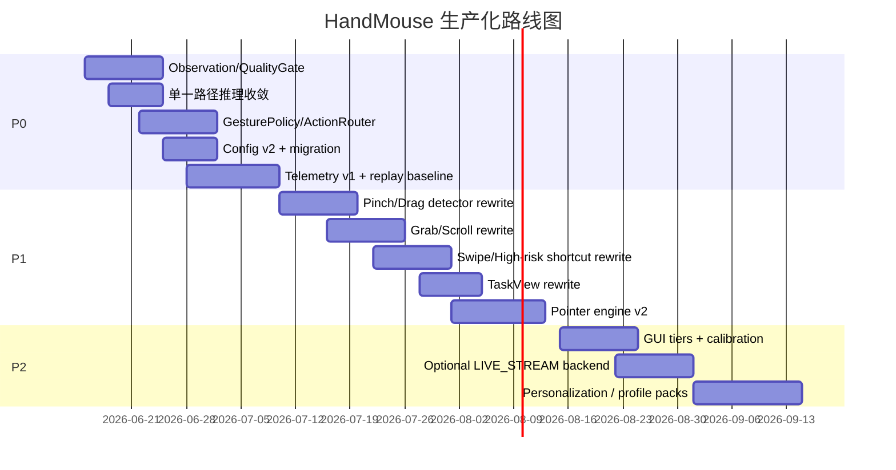

# HandMouse 生产级改造规格草案

## 执行摘要

HandMouse 当前已经不是一个“从零开始”的原型，而是一个具备完整主循环、MediaPipe 手部跟踪、指针引擎、点击/拖拽/滚动/快捷动作、engagement 与 clutch、GUI、调试视图以及简易 telemetry 的可运行系统。仓库中的关键入口仍然集中在 `app.py`，由它协调 `HandTracker`、`PointerEngine`、`GestureDetector`、`GrabScrollDetector`、`ShortcutDetector`、`EngagementFSM`、`MoveModeController`、`MouseController` 和 `ShortcutController` 等模块；互斥控制则主要依赖只有 `CLICK`/`GRAB` 两类锁的 `InteractionInterlock`。这说明项目已经跨过了“能不能跑”的阶段，真正的问题已经转移到“如何把误触发、脆弱阈值和状态耦合变成可度量、可回归、可演进的系统工程”。citeturn29view0turn30view0turn30view1turn28view0

从生产化角度看，当前最重要的短板不是单个阈值，而是架构边界。第一，应用已经启动了 `CameraReader` / `InferenceWorker` 线程，但 `_run_loop` 里仍直接同步调用 `tracker.process(...)`，形成“线程化采集/推理路径”和“主线程同步推理路径”并存的重复结构。第二，检测与动作还没有完全分离，例如 `AltTabDetector` 在检测器内部直接调用 `pyautogui.hotkey/press`，这会显著降低可测试性与风险控制能力。第三，`HandTracker` 当前只向上层暴露 2D landmarks、少量 tip 点、`raw_landmarks` 与 handedness，没有把 world landmarks、质量代理指标、异步回调路径一起纳入统一观测模型；而官方 Hand Landmarker 文档明确区分了 `VIDEO` 与 `LIVE_STREAM` 两种在线模式，并要求 `LIVE_STREAM` 采用异步 result callback。第四，当前 telemetry 仅记录很少的几个字段，远远不足以解释误触发和回归问题。citeturn29view5turn30view2turn37view2turn24view5turn24view6turn13view1turn13view3turn13view4turn41view3turn41view4turn30view7turn30view8

我建议把本项目的生产级改造目标定义为三件事：其一，建立统一的数据模型与仲裁链路，即 `HandObservation -> TrackingQualityGate -> Detectors -> GesturePolicy -> ActionRouter -> OS Adapter`；其二，把“误触发”从阈值问题升级为“意图门控 + 风险路由 + 可观测回放”的系统问题；其三，在 P0 阶段优先保留 `VIDEO` 模式并清理重复推理路径，而不是立即切换 `LIVE_STREAM`，因为当前仓库已经在线程层使用了异步结构，但 `HandTracker.process()` 又明确拒绝 `LIVE_STREAM` 路径，这意味着贸然切换只会增加复杂度而不会自动带来稳定性。与此同时，指针引擎应借鉴 libinput 的多事件 velocity tracker 与自适应加速度思想，而不是继续只依赖单帧位移/速度。citeturn13view3turn13view4turn37view2turn40view2turn40view3

## 当前仓库诊断与现状架构

当前架构的核心特征是：**状态机很多，但仲裁在 `app.py`；动作很多，但策略并未成为一等公民。** 主入口创建相机、跟踪器、指针引擎、点击检测器、抓握滚动检测器、快捷动作检测器、交互锁和其他控制器后，全部被传入 `_run_loop(...)`。与此同时，应用还会启动 `CameraReader` 与 `InferenceWorker` 两个后台线程，但主循环里又直接用 `tracker.process(frame, frame_timestamp_ms=now_ms)` 对当前帧做同步推理。这个结构本身就会让“到底哪一条链路是真正的 source of truth”变得模糊。citeturn29view0turn29view4turn29view5turn30view1turn30view2turn37view2



当前误触发问题的几个直接来源，在代码中已经可以看得很清楚。`GestureDetector` 主要基于 2D thumb-index / thumb-middle 距离，用 `pinch_close` / `pinch_open` 做双阈值，点击默认在 release 时触发，并用 300ms 的窗口叠加 double-click；为避免拳头误判，`app.py` 额外加了一层 `_is_finger_curled(...)` 启发式，把弯曲的食指或中指 tip 直接置空。`GrabScrollDetector` 依赖抓握 pose、hold 时间、垂直帧间位移和滚动灵敏度；`ShortcutDetector` 则只跟踪 `index_tip` 的位移，并在追踪期间以一个 `palm_open` 布尔量决定是否把水平 swipe 升级为 palm-swipe 版本；`AltTabDetector` 使用独立的 pose 状态机，但在 detector 内部直接执行系统动作。也就是说，当前系统里既有 detector 内部状态，又有 app 层 if/else 状态，再叠加一个 interlock，最终构成了多层分散的隐式策略。citeturn20view1turn20view3turn21view0turn21view1turn23view0turn22view6turn27view1turn27view2turn26view2turn26view5turn24view5turn24view6turn31view0turn31view1turn31view2

配置面也明显偏窄。当前 `AppConfig` 暴露的可调表面主要是 camera、pointer `g_hi`、几个 gesture 开关、pinch 两个阈值、scroll sensitivity，以及 `show_osd`；GUI 也只对应暴露了摄像头编号、镜像、指针速度、功能开关、pinch close/open 与滚动灵敏度。更关键的是，运行时热更新函数 `_apply_runtime_settings(...)` 只重建 pointer 的 `g_hi`、gesture 的 pinch 阈值和 grab scroll 的滚动灵敏度，这意味着大量真正左右稳定性的规则仍然散落在 detector 默认值或 `app.py` 的硬编码里，例如 drag threshold、grab 释放后的 shortcut cooldown、alt-tab arming / nav threshold / cooldown 等。你现在感受到的“主要是误触发和硬编码”问题，代码层面完全成立。citeturn16view0turn16view1turn16view4turn16view5turn33view0turn33view1turn33view2turn33view3turn33view4turn30view8turn30view9turn25view0turn25view2turn31view1turn31view2

另一个需要尽快收敛的是镜像与 handedness 语义。当前 `coordinate_mapper.unify_hand_result(...)` 的注释明确写着：相机输入现在总是“在推理前被镜像”，所以 landmarks 与 handedness 可以直接当成统一物理空间使用；函数体里也确实只是原样复制 x/y，并直接透传 `raw_result.handedness_label`。同时，经典 MediaPipe Hands 官方文档又明确提醒：handedness 的判断默认假设输入图像是镜像的自拍视角，如果不是，应用层要交换 handedness 输出。现在仓库里既保留了 `input_is_mirrored` 配置，又在统一映射函数里基本忽略该参数，这种“语义成立依赖隐含前提”的状态在生产环境里很容易演变成摄像头切换后的隐蔽 bug。citeturn38view0turn38view2turn16view3turn42view0turn42view3turn42view4

## 目标生产级架构规格

### 目标数据流与职责分层

生产级版本应当把“检测”和“动作”彻底拆开，把“质量”和“意图”提到策略层。建议的新主干如下图所示。这里最关键的变化是：所有 detector 只产出 **候选手势**，所有 OS 副作用统一下沉到 `ActionRouter` / `ActionBackend`；同时，每一帧都必须带着一个 `TrackingQuality` 进入策略层，任何高风险动作都不能直接越过质量门和风险路由。这个结构既能压制误触发，也能让 telemetry 与 replay 真正有意义。MediaPipe 框架论文本身就强调：开发者需要在目标平台上反复测量“性能、资源消耗与问题案例”，而不是只靠在线手调阈值。citeturn40view3turn29view0turn30view2turn24view5



建议的新模块布局如下，目的是让每个文件只有一种变化原因：

```text
handmouse/
  tracking/
    mediapipe_adapter.py
    observation.py
    quality_gate.py
  features/
    kinematics.py
    geometry_2d.py
    geometry_3d.py
  detectors/
    pinch.py
    grab_scroll.py
    swipe.py
    task_view.py
    move_pose.py
  policy/
    gesture_policy.py
    risk_rules.py
    action_router.py
  actions/
    windows_backend.py
    action_types.py
  telemetry/
    schema.py
    writer.py
    metrics.py
  config/
    schema.py
    migrate.py
    profiles.py
  replay/
    recorder.py
    runner.py
  ui/
    tray.py
    basic_gui.py
    advanced_gui.py
```

### 核心对象与接口建议

下面这组接口足够具体，可以直接作为第一轮重构的目标文件。它们的设计重点是：`HandObservation` 负责“事实”，`TrackingQuality` 负责“质量判定”，`GestureCandidate` 负责“候选”，`GestureIntent` 负责“策略通过后的意图”，`ActionDispatch` 负责“最终动作”。这样一来，误触发就不再是 detector 一次 return 错了，而是可以在多个层次被拦下并被 telemetry 记录。当前仓库中 “interlock 只知道 CLICK/GRAB” 的互斥模型太薄，不足以覆盖高风险快捷动作。citeturn28view0turn24view5turn31view2

```python
from dataclasses import dataclass, field
from enum import Enum
from typing import Literal, Any

class RiskClass(str, Enum):
    LOW = "low"         # pointer move, low-speed scroll
    MEDIUM = "medium"   # click, right click, back/forward
    HIGH = "high"       # Win+D, Task View, Alt-Tab, app/window switching

@dataclass(frozen=True)
class Point2:
    x: float
    y: float

@dataclass(frozen=True)
class Point3:
    x: float
    y: float
    z: float

@dataclass(frozen=True)
class HandObservation:
    frame_id: int
    ts_ms: int
    image_landmarks: list[Point3]              # x,y normalized; z image-depth
    world_landmarks: list[Point3] | None       # meters, if available
    handedness_label: Literal["Left", "Right"] | None
    handedness_score: float | None
    raw_result: Any | None
    stale_ms: int
    camera_space: Literal["mirrored", "physical"]

@dataclass(frozen=True)
class TrackingQuality:
    ok: bool
    score: float                # 0..1
    reasons: tuple[str, ...]
    palm_span_px: float | None
    handedness_ok: bool
    stable_frames: int
    lost_frames: int

@dataclass(frozen=True)
class GestureCandidate:
    detector: str
    gesture: str
    phase: Literal["candidate", "armed", "hold", "release", "fire", "cancel"]
    confidence: float
    risk: RiskClass
    exclusive: bool
    measurements: dict[str, float] = field(default_factory=dict)

@dataclass(frozen=True)
class GestureIntent:
    action: str
    risk: RiskClass
    detector: str
    committed: bool
    payload: dict[str, Any] = field(default_factory=dict)

@dataclass(frozen=True)
class ActionDispatch:
    action: str
    executed: bool
    blocked_by: str | None
    latency_ms: int
```

```python
class TrackingQualityGate:
    def update(self, obs: HandObservation) -> TrackingQuality: ...

class Detector:
    name: str
    def update(self, obs: HandObservation, quality: TrackingQuality) -> list[GestureCandidate]: ...

class GesturePolicy:
    def evaluate(
        self,
        obs: HandObservation,
        quality: TrackingQuality,
        candidates: list[GestureCandidate],
        session_state: dict[str, Any],
    ) -> list[GestureIntent]: ...

class ActionRouter:
    def dispatch(
        self,
        intents: list[GestureIntent],
        session_state: dict[str, Any],
    ) -> list[ActionDispatch]: ...
```

### 配置服务与 GUI 分层

当前 GUI 本质上是“单层 end-user tuning 面板”，直接把少量变量写回配置文件。生产版本建议采用 **YAML 作为人类可编辑配置源，JSON Schema 作为验证与迁移契约**。这样 GUI 可以安全读写，CLI 与 replay 也能共享同一套 schema。当前仓库已经有稳定的 dataclass 配置基础，但暴露面太浅，而且热更新只覆盖少量字段，因此适合在 P0 做 `schema_version: 2` 的迁移层。citeturn16view0turn16view1turn16view5turn33view0turn33view4turn30view8turn30view9

建议的 GUI 分层如下：

| 分层 | 面向对象 | 应暴露内容 | 不应暴露内容 |
|---|---|---|---|
| Tray Quick Controls | 日常使用者 | 启停、当前 profile、OSD 开关、临时禁用高风险动作 | 几何阈值、策略细节 |
| Basic GUI | 普通用户 | 摄像头、镜像/handedness、校准向导、灵敏度、功能开关、测试页 | 质量门细节、所有 detector 内部阈值 |
| Advanced GUI | 维护者/项目 owner | 所有 detector 阈值、策略可视化、telemetry 实时面板、replay 调试、profile 对比 | 默认不对最终用户开放 |

建议的 YAML 配置示例如下。阈值均作为**保守默认值**，不是宣称最优值；真正的最终值要以录制语料和 telemetry 统计回归后再收敛。

```yaml
schema_version: 2
profile: default

capture:
  source: camera
  camera:
    index: 0
    width: 640
    height: 480
    fps_target: 60
    backend_preference: [CAP_DSHOW, CAP_MSMF, CAP_ANY]
    camera_space: mirrored

tracking:
  backend: mediapipe_hand_landmarker
  running_mode: VIDEO
  num_hands: 1
  min_hand_detection_confidence: 0.65
  min_hand_presence_confidence: 0.60
  min_tracking_confidence: 0.72
  use_world_landmarks: true

quality_gate:
  max_stale_ms: 80
  min_palm_span_px: 90
  min_stable_frames: 4
  handedness_min_score: 0.75
  block_when_recent_reacquire_ms: 120
  require_world_for_high_risk: false

pointer:
  mode: relative
  control_region: {left: 0.12, top: 0.10, right: 0.88, bottom: 0.90}
  velocity_tracker:
    window_events: 8
    reset_on_direction_change_deg: 55
    max_age_ms: 90
  adaptive_gain:
    profile: libinput_like
    v_jitter: 0.18
    v_mid: 0.90
    v_fast: 2.80
    g_lo: 0.75
    g_hi: 2.80
    dead_zone_radius: 0.003
    residual_accumulator: true
  depth:
    source: world_then_image_scale
    depth_gamma: 0.75
    z_min: 0.85
    z_max: 1.18

detectors:
  pinch_left:
    enabled: true
    metric: pinch_ratio_to_palm
    enter_threshold: 0.32
    exit_threshold: 0.42
    min_hold_ms: 45
    confirm_frames: 4
    release_confirm_frames: 3
    emit_on_release: true
    double_click_window_ms: 280
  pinch_right:
    enabled: true
    metric: thumb_middle_ratio
    enter_threshold: 0.34
    exit_threshold: 0.44
    confirm_frames: 4
  drag:
    enabled: true
    start_after_hold_ms: 120
    start_travel_ratio: 0.22
  grab_scroll:
    enabled: true
    hold_ms: 150
    release_grace_ms: 140
    dead_zone: 0.012
    vertical_only: true
    scroll_sensitivity: 160
    max_scroll_per_frame: 80
  swipe:
    enabled: true
    anchor: palm_center
    min_duration_ms: 120
    max_duration_ms: 320
    min_distance_ratio: 0.45
    min_straightness: 0.80
    axis_ratio: 1.8
  task_view:
    enabled: true
    arming_time_ms: 450
    nav_threshold_ratio: 0.10
    nav_cooldown_ms: 450
    commit_mode: explicit_pinch_confirm
    cancel_on_quality_drop_ms: 120

policy:
  movement:
    clutch_required: true
    arm_dwell_ms: 150
    pose_loss_grace_ms: 80
  high_risk:
    require_quality_good_ms: 250
    require_explicit_confirm: true
    cooldown_ms: 1000
    zero_tolerance_negative_replay: true

actions:
  windows:
    click_left: mouse.left_click
    click_right: mouse.right_click
    double_click: mouse.double_click
    drag_hold: mouse.left_down
    drag_release: mouse.left_up
    swipe_left: browser.back
    swipe_right: browser.forward
    swipe_up: scroll.down_step
    swipe_down: scroll.up_step
    show_desktop: win+d
    task_view: win+tab

telemetry:
  enabled: true
  ndjson_path: ~/.handmouse/telemetry/session.ndjson
  record_frame_stride: 1
  record_landmarks_stride: 3
  include_world_landmarks: false
```

下面是等价的 JSON 样例，适合 schema 校验与程序测试：

```json
{
  "schema_version": 2,
  "profile": "default",
  "tracking": {
    "backend": "mediapipe_hand_landmarker",
    "running_mode": "VIDEO",
    "num_hands": 1,
    "min_hand_detection_confidence": 0.65,
    "min_hand_presence_confidence": 0.60,
    "min_tracking_confidence": 0.72,
    "use_world_landmarks": true
  },
  "quality_gate": {
    "max_stale_ms": 80,
    "min_palm_span_px": 90,
    "min_stable_frames": 4,
    "handedness_min_score": 0.75
  },
  "policy": {
    "high_risk": {
      "require_quality_good_ms": 250,
      "require_explicit_confirm": true,
      "cooldown_ms": 1000
    }
  }
}
```

## 检测器、指针引擎与 MediaPipe 使用规范

### TrackingQualityGate 规格

HandMouse 现在需要的不是“更复杂的 detector”，而是一个统一的 `TrackingQualityGate`。原因很直接：官方 Hand Landmarker 的三个置信度阈值——`min_hand_detection_confidence`、`min_hand_presence_confidence`、`min_tracking_confidence`——决定的是**内部何时重跑 palm detection、何时继续沿用 tracking**，而公开 Python 结果示例主要列出的是 **Handedness、Landmarks、WorldLandmarks**；也就是说，在你当前的 Python Tasks 使用方式里，不能假设每帧都能直接读到 presence/tracking score。当前仓库的 `HandTracker` 也只把 2D landmarks、tip 点、`raw_landmarks` 和 handedness 暴露给上层，并且当 `running_mode == LIVE_STREAM` 时直接抛异常。基于这些事实，P0 最务实的做法不是强行追 per-frame 内部 score，而是先做**代理质量指标**。citeturn41view0turn41view1turn41view2turn41view3turn41view5turn13view1turn13view3turn14view0turn14view1

建议 `TrackingQualityGate` 的代理指标至少包括以下几项：

| 指标 | 计算方式 | 建议默认值 | 用途 |
|---|---|---|---|
| `stale_ms` | 当前 wall clock - 结果时间戳 | `<= 80ms` | 阻止旧帧触发动作 |
| `landmark_count_ok` | `len(image_landmarks) == 21` | 必须为真 | 基础完整性 |
| `palm_span_px` | `index_mcp` 到 `pinky_mcp` 像素距离 | `>= 90px` | 手太小/太远时禁用高风险动作 |
| `handedness_ok` | handedness score 达门槛，且镜像语义明确 | `>= 0.75` | 只对 handedness 敏感动作启用 |
| `stable_frames` | 连续 good frame 数 | `>= 4` | 抑制 reacquire 抖动 |
| `recent_reacquire_ms` | 从 lost 到 reacquire 的时间 | `> 120ms` 才放行动作 | 抑制丢失后瞬时误触发 |
| `world_ok` | 有 world landmarks 且无 NaN / 异常跳变 | 供高风险动作可选要求 | 提升 3D 手势几何稳定性 |

上表中的各项是工程建议，不是官方 API 语义。它们的必要性来自两部分事实：一是 MediaPipe 把在线 tracking/detection 的切换逻辑隐藏在内部阈值里；二是当前仓库的 detector 大多直接消费一次性的 2D landmark 几何，缺少统一的“这帧能不能信”的前置判断。citeturn41view1turn41view2turn20view3turn23view0turn27view2

### Pinch、Grab、Shortcut、Alt-Tab 检测器改造

**Pinch / click / drag。** 当前点击检测器使用 2D pinch 距离进入/退出阈值、少量 confirm frame、release 触发 click、300ms 内第二次 release 触发 double-click；drag 则在 `PINCH_HOLD` 后额外比较 index tip 相对 pinch 起点位移，超过 `0.04` 才进入拖拽。这种做法已经有基本骨架，但它最大的问题是：判定主要基于 2D 投影视角，且 click/drag 的区分发生得太晚。建议重构为三个明确阶段：`candidate -> armed -> hold/drag -> release/commit`。几何指标改为以 **palm-span ratio** 为主，以 **world-space pinch distance** 为辅。`click_left` 和 `click_right` 都只在 `release_confirm` 后由 policy 决策是否 commit；drag 则在 `hold_ms + start_travel_ratio` 同时满足时进入 exclusivity。保守默认值建议是：left pinch `enter_threshold=0.32`、`exit_threshold=0.42`、`confirm_frames=4`、`release_confirm_frames=3`、`double_click_window_ms=280`；drag `start_after_hold_ms=120`、`start_travel_ratio=0.22`。这些阈值是建议值，最终应由 replay 语料微调。citeturn20view1turn20view3turn21view0turn21view1turn31view1turn41view10

**Grab / scroll。** 当前抓握滚动检测器已经比 shortcut 更接近生产形态：它有 `candidate`、`grabbing/dragging`、`released`，含 hold、release grace、post-release grace、dead zone 和 scroll sensitivity，且抓握姿态还会按 palm scale 做归一化。但是 scroll 仍然只来自 2D 垂直帧间位移 `frame_delta_y`，并直接 round 成整数步进。如果用户手掌发生朝相机的推进或有轻微横向旋转，2D 垂直分量很容易把非滚动动作吸进来。建议把 `grab_scroll` 的核心特征改成：`grab_pose_confidence`、`palm_center_dy_world_norm`、`hand_plane_tilt`、`thumb-index safety distance`。具体规则是：只有在“抓握 pose 稳定 + 非 pinch click + 质量为 good”的条件下，才允许 scroll；如果纵向位移主要来自 z 方向的推进，则 block；如果 quality 下降或 reacquire，延长 post-release cooldown。保守默认值建议：`hold_ms=150`、`release_grace_ms=140`、`dead_zone=0.012`、`scroll_sensitivity=160`、`max_scroll_per_frame=80`。citeturn23view0turn22view4turn22view5turn22view6turn10view1turn10view2turn41view5turn41view10

**Shortcut / swipe。** 当前 `ShortcutDetector` 只跟踪一个 anchor 到 `index_tip` 的位移，在 tracking 期间只要 `palm_open` 曾经为真，水平 swipe 就可映射成 `SWIPE_LEFT_PALM` / `SWIPE_RIGHT_PALM`，并在 app 层把它解释成 `Win+D`。这就是典型的误触发高风险区：因为信号源太单一、动作语义太强，而且 action 危险度与质量门并未挂钩。建议把 swipe detector 改成基于 `palm_center` 或 `wrist-middle_mcp` 组合锚点，而不是 index tip；同时引入 `min_duration_ms`、`max_duration_ms`、`path_straightness`、`orthogonal_axis_ratio`、`peak_speed` 和 `end_release_required`。更重要的是，**任何 palm-swipe / show-desktop / window/task switching 类动作都必须升级为 high-risk intent**，由 `GesturePolicy` 要求额外的显式确认。保守默认值建议：`anchor=palm_center`、`min_duration_ms=120`、`max_duration_ms=320`、`min_distance_ratio=0.45`、`axis_ratio=1.8`、`min_straightness=0.80`。citeturn27view1turn27view2turn26view2turn26view5turn26view6turn31view2

**Alt-Tab / task view。** 当前 `AltTabDetector` 已有 `INACTIVE -> ARMING -> ACTIVE` 状态机，使用 palm center 做导航，但它有两个生产级缺陷：一是 detector 本身直接发 `Win+Tab` 与方向键、Enter；二是在 pose 丢失时直接 `_submit_selection()`，这会让“退出姿态”的行为变成“提交操作”。对于高风险动作，这个策略太冒险。建议把它改名为 `TaskViewDetector`，只产出 `candidate/preview/navigate/commit/cancel` 候选，不做任何系统调用；路由层再根据风险规则决定是否真正发键。建议默认流程是：稳定 pose 450ms 进入 preview，屏幕上显示 OSD“Task View”；导航依靠 palm center 位移；**commit 必须由显式 pinch confirm 或特定 release confirm 完成**；quality 下降、pose 丢失或 timeout 则 cancel。当前 detector 的 350ms arming、0.08 nav threshold 和 400ms cooldown 可以作为 `task_view.experimental_legacy` profile 保留，供 A/B 测试。citeturn25view0turn25view2turn25view4turn24view5turn24view6

下面这个状态图适合作为所有“有副作用手势”的统一策略模板：



### PointerEngine 改造与 libinput 思想迁移

当前 `PointerEngine` 的优点是已经具备速度相关 gain、depth factor、dead zone 与 hand scale 估计；但它的速度是**单帧 displacement / dt**，然后直接按 `round(pixel_per_palm_width * gain * depth_factor * u_x)` 生成整型位移。与 libinput 的 adaptive acceleration 相比，这里少了一个非常重要的层：**跨多个输入事件的 velocity tracker**。libinput 的设计明确会在多个 event 上积累 tracker，当方向变化或速度显著变化时重置速度估计；它还把非常低速运动映射到 deceleration 区间，把常规速度映射到接近 1:1，再把高速运动逐步抬升到更高 gain。HandMouse 当前的单帧速度理论上能跑，但在“静止抖动”“慢速精确对准”“短时 frame drop”“重新锚定后第一帧跳动”等情形下，会天然比多事件 tracker 更脆弱。citeturn18view4turn19view2turn19view3turn40view2

因此，`PointerEngine` 的 P1 规格应至少包含四个变化。第一，引入 `VelocityTracker` 环形缓冲区，窗口 6 到 10 个 event，按方向连续性和 age 限制计算速度；第二，把 gain 曲线改成显式配置的 profile，默认可采用 “libinput-like”：低速 decelerate、中速近 1:1、高速上抬；第三，加入 `subpixel residual accumulator`，避免每帧 round 后低速小位移全被吞掉；第四，把 depth 从当前基于 2D hand scale 的近似估计，升级为 “world landmarks 可用时优先 world ratio，否则退回 image z / palm-scale proxy”。官方文档说明 image-landmark `z` 是以 wrist 为原点的深度，值越小越靠近相机；world landmarks 则是以手近似几何中心为原点、单位为米的 3D 坐标。基于这个定义，我的工程建议是：**world 信息主要用于相对比例和时间变化，而不是把绝对米值直接当成强控制量**。这是基于输出语义做出的工程推断。citeturn41view5turn41view9turn41view10turn19view2turn19view3

下面这张对比表，概括了当前指针引擎与建议方案的差异：

| 维度 | 当前实现 | 建议实现 |
|---|---|---|
| 速度估计 | 单帧 `displacement / dt` citeturn18view4turn19view2 | 多事件 `VelocityTracker`，方向/速度改变即重置，借鉴 libinput tracker 语义 citeturn40view2 |
| 增益曲线 | `v_jitter -> v_mid -> v_fast` 线性/平滑插值 citeturn18view1turn19view2 | profile 化，支持 `adaptive/flat/custom` 思路，后续可开放 profile editor citeturn40view2 |
| 深度因子 | 依赖 2D hand scale median 估计 citeturn18view3turn19view3 | world-landmark ratio 优先，image z 与 palm span 作为回退 citeturn41view5turn41view10 |
| 低速精度 | 每帧 round，易丢 subpixel | 浮点残差累计 + 低速 deceleration |
| 重新获取 | 丢帧即清空 previous point/timestamp citeturn19view0turn19view1 | 引入短暂 holdover 与再锚定抑制，避免 reacquire jump |

### MediaPipe 使用建议

对当前项目来说，**P0 推荐继续使用 `VIDEO`，但把链路收敛为单一路径；P2 才把 `LIVE_STREAM` 作为可选优化**。理由有三。第一，官方 Tasks 文档明确说明：`VIDEO` 适合解码帧流，调用 `detect_for_video(...)`；`LIVE_STREAM` 需要异步 `result_callback`。第二，当前 `HandTracker` 已把默认 running mode 设为 `VIDEO`，并在 `LIVE_STREAM` 下直接抛异常，要求未来实现 `process_async()`。第三，仓库已经有 `CameraReader` / `InferenceWorker` 两线程结构，但主循环里仍直接做同步推理，所以当前最缺的是“链路收敛”，不是“再加一种异步模式”。citeturn41view3turn41view4turn13view1turn13view3turn13view4turn29view5turn30view2turn37view2

MediaPipe 的具体使用规范建议如下。对于 handedness，必须在配置里显式记录 `camera_space` 是 `mirrored` 还是 `physical`；不要再依赖隐式注释约定。对于 landmarks，始终同时保留 image landmarks 与 world landmarks；image z 用于轻量深度趋势与 UI overlay，world landmarks 用于尺度归一化和 3D 几何。对于 `min_hand_detection_confidence` / `min_hand_presence_confidence` / `min_tracking_confidence`，P0 可保守设为 `0.65 / 0.60 / 0.72` 起步，原因是官方默认全为 `0.5`，而旧 Hands 文档也明确指出更高 `min_tracking_confidence` 会提升稳健性但增加时延，因此你需要通过 replay 和 telemetry 去找平衡点，而不是把它们当成“越高越好”的万能开关。citeturn41view0turn41view1turn41view2turn42view0turn42view3turn42view4

## 安全、遥测与测试规格

### 高风险动作安全规则

高风险动作应明确包括：`Win+D`、Task View / Alt-Tab、窗口切换、应用切换、任何会隐藏当前工作上下文或改变焦点堆栈的动作。当前仓库里，`SWIPE_LEFT_PALM` / `SWIPE_RIGHT_PALM` 会映射到桌面动作，`AltTabDetector` 会触发 `Win+Tab` 并在退出时提交选择；这些都应纳入 high-risk 档。citeturn26view5turn26view6turn31view2turn24view5turn24view6

建议的安全规则如下，全部进入 `risk_rules.py`，不得再分散在 detector 内部：

1. **高风险动作永不由 detector 直接执行。** detector 只能产生 `GestureCandidate`。这一条要在代码审查层面执行到底；例如未来 `detectors/` 目录内不应再出现 `pyautogui` 等副作用 API。当前 `AltTabDetector` 的直接按键实现应整体搬到 `actions/windows_backend.py`。citeturn24view5turn24view6  
2. **高风险动作必须满足 `quality.good_for_ms >= 250ms`。** 如果刚 reacquire、stale、palm span 太小或 handedness 不确定，统一阻断。  
3. **高风险动作必须显式确认。** 推荐 `preview -> explicit pinch confirm -> commit`，不允许“姿态退出即提交”。  
4. **高风险动作与 drag / grab / pointer move 互斥。** 当前 interlock 只有 CLICK/GRAB 两类；新策略层应扩展为 `POINTER_MOVE`、`CLICK`、`DRAG`、`SCROLL`、`HIGH_RISK_PREVIEW`、`HIGH_RISK_COMMIT` 六种逻辑互斥状态。  
5. **高风险动作必须写 telemetry。** 每次被 block，也要记录 `blocked_by` 原因；否则你无法知道 gate 是否过严。  
6. **负样本回放零容忍。** 在 negative corpus 上，高风险动作的 dispatch 目标应为 0。  

最近的 clutching 研究本身就把“如何减少 Midas-touch 式误触发”作为研究对象，说明把“意图锁”升级为一等功能是合理方向；而你的仓库里现有 `clutch` 与 `move_mode` 已经证明这一思路在当前项目里是可落地的，只是还没有被推广到所有高风险动作。citeturn39search5turn35view0turn35view4turn31view0

### Telemetry 结构、事件模型与核心指标

当前 telemetry 只是逐行 NDJSON，字段包括时间、frame age、pointer dx/dy、engagement active、click、scroll、clutch、move mode。这个方向是对的，因为 NDJSON 很适合流式写盘和回放，但字段密度远远不够。生产版本建议保留 NDJSON 主格式，再加 schema 校验和离线聚合。citeturn30view7turn30view8

建议的 telemetry ER 模型如下：



建议将事件分为以下几类：

| 事件 | 触发时机 | 关键字段 |
|---|---|---|
| `frame_sample` | 每 N 帧 | `session_id`, `frame_id`, `ts_ms`, `stale_ms`, `fps`, `landmark_count`, `palm_span_px`, `handedness_score`, `pointer_velocity`, `pointer_gain`, `depth_factor` |
| `quality_change` | quality 状态变化 | `ok`, `score`, `reasons`, `stable_frames`, `lost_frames` |
| `gesture_candidate` | detector 产生候选 | `detector`, `gesture`, `phase`, `confidence`, `measurements` |
| `gesture_decision` | policy 输出 intent | `action`, `risk`, `committed`, `blocked_by` |
| `action_dispatch` | backend 执行动作 | `executed`, `latency_ms`, `backend`, `os_error` |
| `session_state` | engagement/clutch/move mode 变化 | `engagement`, `clutch_down`, `move_mode`, `drag_active` |
| `error` | 异常 | `component`, `exception_type`, `message` |

这组 schema 的价值在于：它可以把误触发还原成“跟踪差”“候选错”“策略没挡住”“backend 延迟过大”中的哪一类。MediaPipe 框架论文强调的是**把 prototype 推到 polished application 时，性能与问题案例必须可测量**；当前项目已经有 telemetry 雏形，因此最划算的路线不是换框架，而是把可观测性补齐。citeturn40view3turn30view7turn30view8

建议追踪的核心指标及目标如下。这里的数值是**项目管理目标**，不是论文结论：

| 指标 | P0 门槛 | P1 目标 | P2 目标 |
|---|---:|---:|---:|
| 高风险误触发 | 负样本回放为 0 | 真实负样本会话为 0 | 长时录制为 0 |
| 低/中风险误触发 | ≤ 0.2 次 / 10 分钟 | ≤ 0.1 次 / 10 分钟 | ≤ 0.05 次 / 10 分钟 |
| stationary jitter p95 | ≤ 6 px / 5s | ≤ 4 px / 5s | ≤ 3 px / 5s |
| click latency p50 | ≤ 140ms | ≤ 120ms | ≤ 100ms |
| frame stale p95 | ≤ 90ms | ≤ 70ms | ≤ 50ms |
| reacquire 后误动作 | 明显下降 | 基本消失 | 统计学上接近 0 |

下面给出建议的 telemetry 样例。推荐保持 NDJSON，一行一个事件：

```json
{"event":"frame_sample","schema_version":1,"session_id":"2026-06-11T21-30-15Z_winson_default","frame_id":1824,"ts_ms":1781209915234,"stale_ms":24,"fps":58.3,"landmark_count":21,"palm_span_px":126.4,"handedness_label":"Right","handedness_score":0.97,"pointer_velocity":0.84,"pointer_gain":0.93,"depth_factor":1.04,"quality_ok":true,"quality_score":0.91}
{"event":"gesture_candidate","schema_version":1,"session_id":"2026-06-11T21-30-15Z_winson_default","frame_id":1825,"detector":"pinch_left","gesture":"click_left","phase":"armed","confidence":0.88,"measurements":{"pinch_ratio":0.29,"thumb_index_world_m":0.026}}
{"event":"gesture_decision","schema_version":1,"session_id":"2026-06-11T21-30-15Z_winson_default","frame_id":1828,"action":"show_desktop","risk":"high","committed":false,"blocked_by":"require_explicit_confirm"}
{"event":"action_dispatch","schema_version":1,"session_id":"2026-06-11T21-30-15Z_winson_default","frame_id":1840,"action":"click_left","risk":"medium","executed":true,"blocked_by":null,"latency_ms":37,"backend":"windows_pyautogui"}
```

### 录制流程、回放流程与测试体系

如果你要真正把稳定性做上去，必须把“误触发”从主观体验变成语料库和回放指标。建议在仓库里引入一个最小可行的数据闭环：**录制原视频 + 记录配置快照 + 导出 landmarks/telemetry + 回放时复现相同 detector/policy**。当前项目已经具备线程化采集、同步推理和 NDJSON 写盘基础，因此新增 recorder / replay runner 的改造成本并不高。citeturn29view5turn30view2turn30view7turn37view2

建议的录制样本最小集如下：

| 类别 | 内容 | 最低样本量 |
|---|---|---:|
| 正样本 | left click / right click / double click / drag / scroll / swipe / task view | 每类 40 段 |
| 近似负样本 | 握拳、半捏合、伸指晃动、抓握后松手、手靠近镜头、换手、靠边缘移动 | 每类 60 段 |
| 环境变化 | 正常光、逆光、低光、复杂背景 | 每环境至少 20 段 |
| 设备变化 | 30fps 相机、60fps 相机、不同视角/焦距 | 每设备至少 20 段 |
| 用户变化 | owner + 至少 2 名外部用户 | 每人至少 1 套负样本录制 |

建议目录结构：

```text
recordings/
  2026-06/
    session_001/
      config.snapshot.yaml
      video.mp4
      telemetry.ndjson
      labels.json
      notes.md
```

测试体系建议分成四层。第一层是**纯几何单元测试**，覆盖 palm span、pinch ratio、world/image 回退、straightness、velocity tracker、quality gate。第二层是**状态机单元测试**，覆盖 pinch / grab / swipe / task view 的 candidate-armed-fire-cancel-cooldown 迁移。第三层是**回放集成测试**，用固定录制数据驱动全链路，断言“高风险 0 误触发”“误触发率较 baseline 下降 X%”“telemetry schema 全部有效”。第四层是**交互 smoke test**，只验证 backend 层映射是否正确，不让 detector 测试依赖真实 OS。现在 `AltTabDetector` 检测与执行耦合，正好会妨碍你建立后三层测试，所以这件事必须提前拆。citeturn24view5turn24view6turn31view2

## 迁移计划、GitHub Issues 与路线图

### 迁移策略

推荐采用“**兼容旧配置、分阶段替换主干、始终保留回退路径**”的迁移方案。具体来说，P0 不要大规模推翻现有 detector，而是先引入新数据模型和 policy/router 外壳，让旧 detector 通过 adapter 接口接入；P1 再逐个替换 pinch、grab、swipe、task view；P2 再考虑 LIVE_STREAM 或个性化 profile。这样做的好处是，你可以先把可观测性、回放和 high-risk 安全做起来，先止住最糟糕的误触发，再让 detector 逐步升级。这个顺序跟当前仓库的现状是匹配的：因为当前已经有不少模块化 detector，只是缺少统一的质量与策略层。citeturn20view1turn23view0turn27view1turn25view0turn28view0

### 建议创建的 GitHub Issues

下面这组 issue 我按优先级给出，标题和验收都尽量做到可直接落地。

| 优先级 | Issue 标题 | 交付内容 | 验收标准 |
|---|---|---|---|
| P0 | 引入 `HandObservation` 与 `TrackingQualityGate` | 新增 tracking 数据模型与质量门 | 单元测试覆盖 stale / palm span / stable frames / handedness gate；高风险动作在 `quality_ok=false` 时 100% block |
| P0 | 删除重复推理真相源 | 统一只保留一条在线推理链路 | 若启用 worker，则 `_run_loop` 不再直接 `tracker.process`；若保留同步 VIDEO，则完全移除未消费的结果缓冲；frame/result 时间戳单调递增 |
| P0 | 引入 `GesturePolicy` 与 `ActionRouter` | detector 只产候选，动作统一路由 | `detectors/` 内不再直接调用 OS API；新增 policy/risk 单元测试；`AltTabDetector` 不再直接按键 |
| P0 | 配置 schema v2 与迁移器 | `schema_version:2`、YAML 配置、旧 JSON 迁移 | 旧 `~/.handmouse/config.json` 可无损迁移；未知字段有 warning；GUI 能正确读写 v2 |
| P0 | telemetry v1 与 schema 校验 | NDJSON 事件模型、writer、validator | 连续 30 分钟录制无损坏行；事件可通过 schema 校验；`blocked_by` 可统计 |
| P0 | 建立 replay harness 与 baseline corpus | 录制器、回放器、最小负样本集 | 负样本回放可自动跑 CI；输出误触发统计；形成 baseline 报告 |
| P1 | 重写 pinch/click/drag 检测器 | ratio + hold + explicit phases | click/drag 状态机测试通过；owner 正负样本集上误触发较 baseline 下降 ≥ 50% |
| P1 | 重写 grab/scroll 检测器 | 3D/ratio 特征 + release 安全 | 负样本中握拳/近镜头推进不再触发滚动；追踪丢失后不产生异常 scroll burst |
| P1 | 重写 swipe/high-risk shortcut | palm-center anchor + straightness + explicit confirm | `Win+D` 等高风险动作的负样本误触发为 0；近似负样本不再由 index drift 触发 |
| P1 | 重写 task-view detector | preview / navigate / confirm / cancel | pose 丢失不再自动提交；只有显式确认才 commit；回放测试覆盖导航与取消 |
| P1 | 指针引擎升级为 velocity tracker + residual | 多事件 tracker、adaptive gain、残差累积 | stationary jitter p95 明显下降；低速移动连续且无阶梯感；CI 回放可见 gain/velocity 事件 |
| P2 | GUI 三层化与校准向导 | Tray/Basic/Advanced GUI | 普通 GUI 不暴露高级阈值；Advanced GUI 可实时看 quality / detector timeline |
| P2 | 可选 `LIVE_STREAM` backend | async callback 版 adapter | 仅在回放与真实设备上证明 frame stale p95 优于 VIDEO 路径后再默认启用 |

### 路线图

下面给出一个按当前日期展开的保守路线图。日期是建议排期，不是承诺时点。



### 最终建议的落地顺序

如果只给一条最短路径，我会建议你按这个顺序推进。先修“**链路和策略**”，再修“**几何和阈值**”。原因很简单：如果没有统一的 `TrackingQualityGate`、`GesturePolicy`、`ActionRouter` 和 replay corpus，你今天把 pinch 阈值调得准一点，明天换个摄像头、换个光照，误触发仍会回来；反过来，如果先建立了质量门、风险路由和 telemetry，即便 detector 还没全部重写，你也已经能把“高风险误动作”先压到接近 0。对 HandMouse 这种交互系统来说，这才是通向“稳定好用”的真正拐点。这个判断与当前仓库的结构、官方 MediaPipe 在线模式语义、以及 libinput 对 pointer acceleration 的工程经验是一致的。citeturn29view5turn30view2turn41view1turn41view2turn41view3turn40view2turn40view3