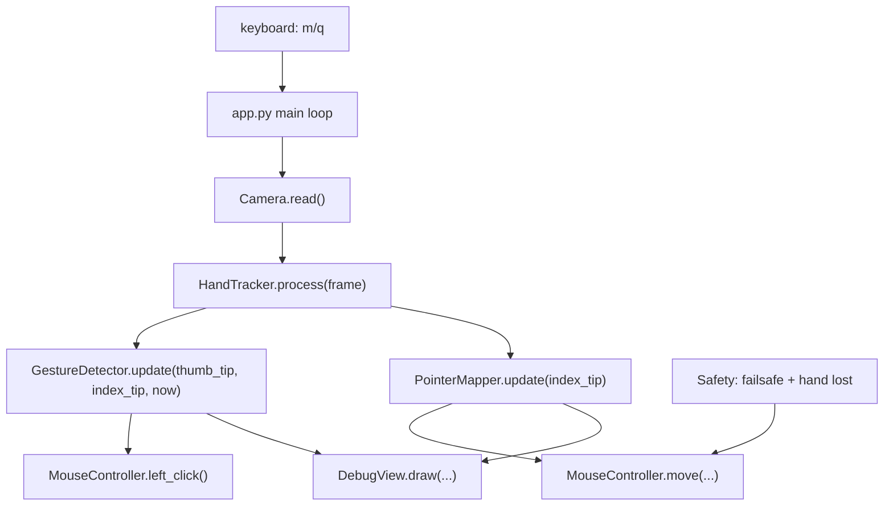

# HandMouse Prototype Implementation Plan

Date: 2026-06-06
Spec: `docs/superpowers/specs/2026-06-06-handmouse-prototype-design.md`
Scope: Windows-native Python technical prototype for webcam hand-controlled mouse movement and left click.

## Scope Check

This plan implements one subsystem: a local Python prototype. It does not include a packaged desktop app, tray UI, installer, right click, drag, scrolling, gesture configuration, or custom model training.

## Target File Structure

```text
HandMouse/
  README.md
  requirements.txt
  src/
    handmouse/
      __init__.py
      app.py
      camera.py
      config.py
      debug_view.py
      gesture_detector.py
      hand_tracker.py
      mouse_controller.py
      pointer_mapper.py
  tests/
    test_gesture_detector.py
    test_pointer_mapper.py
```

Responsibilities:

- `README.md`: setup, run command, keyboard controls, safety notes, troubleshooting.
- `requirements.txt`: runtime and test dependencies.
- `src/handmouse/config.py`: dataclasses/constants for camera, mapping, gesture, debug, and safety settings.
- `src/handmouse/camera.py`: webcam lifecycle wrapper around OpenCV.
- `src/handmouse/hand_tracker.py`: MediaPipe Hands wrapper returning normalized landmarks and selected hand metadata.
- `src/handmouse/pointer_mapper.py`: maps index fingertip from camera/control-region coordinates to screen coordinates with smoothing and optional dead zone.
- `src/handmouse/gesture_detector.py`: pinch-state machine that emits one left-click event per valid pinch.
- `src/handmouse/mouse_controller.py`: debug/control mode abstraction over PyAutoGUI movement and click injection.
- `src/handmouse/debug_view.py`: OpenCV overlay drawing for landmarks, control rectangle, raw/smoothed pointer, mode, gesture state, FPS, and pinch distance.
- `src/handmouse/app.py`: main loop, component wiring, keyboard handling for `m` and `q`, resource cleanup.
- `tests/test_pointer_mapper.py`: deterministic unit tests for mapping, smoothing, clamping, and lost-hand reset behavior.
- `tests/test_gesture_detector.py`: deterministic unit tests for pinch duration, cooldown, release requirement, and no-repeat clicking.

## Architecture Flow



## Task 1: Create Python Project Skeleton

Files:

- Create `requirements.txt`.
- Create `README.md`.
- Create `src/handmouse/__init__.py`.
- Create empty module files listed in the target structure.
- Create empty test files listed in the target structure.

Dependencies in `requirements.txt`:

```text
opencv-python>=4.13.0.92
mediapipe>=0.10.35
pyautogui>=0.9.54
pytest>=8.0
```

README must include:

- Windows setup instructions.
- `python -m venv .venv`
- `.venv\Scripts\activate`
- `pip install -r requirements.txt`
- `python -m handmouse.app`
- Controls: `m` toggles real mouse control, `q` exits.
- Safety: app starts in debug mode and PyAutoGUI failsafe remains enabled.

Verification:

```powershell
python -m pip install -r requirements.txt
python -m pytest
```

Expected output:

- Install completes without dependency resolution errors.
- `pytest` reports zero tests at scaffold time, then real assertion-based passing tests after Tasks 3 and 4.

Commit:

```powershell
git add README.md requirements.txt src tests
git commit -m "chore: scaffold HandMouse Python project"
```

## Task 2: Implement Config Types

Files:

- Modify `src/handmouse/config.py`.
- Add tests only if config contains behavior. Otherwise verify by import.

Implementation:

- Define dataclasses:
  - `CameraConfig(width: int, height: int, index: int)`
  - `ControlRegion(left: float, top: float, right: float, bottom: float)` using normalized frame coordinates.
  - `PointerConfig(smoothing: float, dead_zone_px: float, control_region: ControlRegion)`
  - `GestureConfig(pinch_threshold: float, hold_ms: int, cooldown_ms: int, release_threshold: float)`
  - `AppConfig(camera: CameraConfig, pointer: PointerConfig, gesture: GestureConfig)`
- Provide `DEFAULT_CONFIG`.
- Keep normalized distances for gesture thresholds so camera resolution changes do not invalidate them.

Verification:

```powershell
python -c "from handmouse.config import DEFAULT_CONFIG; print(DEFAULT_CONFIG)"
```

Expected output:

- A printed `AppConfig(...)` object.

Commit:

```powershell
git add src/handmouse/config.py
git commit -m "feat: add prototype configuration types"
```

## Task 3: Implement and Test Pointer Mapping

Files:

- Modify `src/handmouse/pointer_mapper.py`.
- Modify `tests/test_pointer_mapper.py`.

Implementation:

- Define immutable/simple point types if useful:
  - `FramePoint(x: float, y: float)` normalized to `0.0..1.0`.
  - `ScreenPoint(x: int, y: int)` in pixels.
- Implement `PointerMapper`.
- Constructor inputs:
  - `screen_width: int`
  - `screen_height: int`
  - `config: PointerConfig`
- Public methods:
  - `update(point: FramePoint | None) -> ScreenPoint | None`
  - `reset() -> None`
- Behavior:
  - `None` input resets tracking and returns `None`.
  - Clamp input to configured control region.
  - Normalize within the control region.
  - Map to screen dimensions.
  - Apply exponential moving average:
    - First valid point initializes directly.
    - Subsequent points use `smoothed = previous + smoothing * (target - previous)`.
  - Apply dead zone after smoothing if configured.

Tests:

- Center of control region maps to center of screen.
- Points outside the region clamp to edges.
- First point does not lag.
- Second point is smoothed.
- `None` resets smoothing state.

Verification:

```powershell
python -m pytest tests/test_pointer_mapper.py -v
```

Expected output:

- All pointer mapper tests pass.

Commit:

```powershell
git add src/handmouse/pointer_mapper.py tests/test_pointer_mapper.py
git commit -m "feat: add pointer mapping and smoothing"
```

## Task 4: Implement and Test Pinch Gesture Detector

Files:

- Modify `src/handmouse/gesture_detector.py`.
- Modify `tests/test_gesture_detector.py`.

Implementation:

- Define `GestureState` enum:
  - `NO_HAND`
  - `MOVING`
  - `PINCH_CANDIDATE`
  - `CLICK`
  - `COOLDOWN`
- Define result dataclass:
  - `GestureResult(state: GestureState, should_click: bool, pinch_distance: float | None)`
- Implement `GestureDetector`.
- Public methods:
  - `update(thumb: FramePoint | None, index: FramePoint | None, now_ms: int) -> GestureResult`
  - `reset() -> None`
- Behavior:
  - Missing landmarks reset to `NO_HAND`.
  - Pinch starts when thumb-index distance is below `pinch_threshold`.
  - Click emits only after pinch is held for `hold_ms`.
  - After click, enter cooldown for `cooldown_ms`.
  - Do not emit another click until pinch distance exceeds `release_threshold`.

Tests:

- No hand returns `NO_HAND` and no click.
- Short pinch does not click.
- Held pinch emits exactly one click.
- Continuing to hold during cooldown does not repeat.
- Releasing after cooldown allows a new click.

Verification:

```powershell
python -m pytest tests/test_gesture_detector.py -v
```

Expected output:

- All gesture detector tests pass.

Commit:

```powershell
git add src/handmouse/gesture_detector.py tests/test_gesture_detector.py
git commit -m "feat: add pinch left-click state machine"
```

## Task 5: Implement Mouse Controller

Files:

- Modify `src/handmouse/mouse_controller.py`.

Implementation:

- Wrap PyAutoGUI behind `MouseController`.
- Public methods:
  - `set_control_enabled(enabled: bool) -> None`
  - `is_control_enabled() -> bool`
  - `move(point: ScreenPoint | None) -> None`
  - `left_click() -> None`
- Behavior:
  - Set `pyautogui.FAILSAFE = True`.
  - If control is disabled, movement and clicks are no-ops.
  - If point is `None`, do nothing.
  - Use `pyautogui.moveTo(x, y, duration=0)` for movement.
  - Use `pyautogui.click(button="left")` for click.
- Keep the module thin so it can be manually verified without moving the mouse during unit tests.

Verification:

```powershell
python -c "from handmouse.mouse_controller import MouseController; m=MouseController(); print(m.is_control_enabled())"
```

Expected output:

- `False`

Commit:

```powershell
git add src/handmouse/mouse_controller.py
git commit -m "feat: add safe mouse controller"
```

## Task 6: Implement Camera and Hand Tracker

Files:

- Modify `src/handmouse/camera.py`.
- Modify `src/handmouse/hand_tracker.py`.

Implementation:

`camera.py`:

- Implement `Camera`.
- Public methods:
  - `open() -> None`
  - `read() -> tuple[bool, Any]`
  - `release() -> None`
- Set requested width and height from config.
- Raise a clear error if the camera cannot be opened.

`hand_tracker.py`:

- Wrap MediaPipe Hands.
- Public methods:
  - `process(frame_bgr) -> HandTrackingResult`
  - `close() -> None`
- Convert BGR to RGB before MediaPipe processing.
- Return:
  - selected hand landmarks as normalized points.
  - thumb tip landmark.
  - index tip landmark.
  - raw MediaPipe landmarks for drawing.
  - selected hand label/confidence if available.
- If multiple hands are found, use the first confident hand for version 1.

Verification:

```powershell
python -c "from handmouse.camera import Camera; from handmouse.config import DEFAULT_CONFIG; c=Camera(DEFAULT_CONFIG.camera); print('camera-class-ok')"
python -c "from handmouse.hand_tracker import HandTracker; h=HandTracker(); print('tracker-class-ok'); h.close()"
```

Expected output:

- `camera-class-ok`
- `tracker-class-ok`

Commit:

```powershell
git add src/handmouse/camera.py src/handmouse/hand_tracker.py
git commit -m "feat: add camera and hand tracking wrappers"
```

## Task 7: Implement Debug View

Files:

- Modify `src/handmouse/debug_view.py`.

Implementation:

- Draw on top of the camera frame:
  - MediaPipe landmarks.
  - Control rectangle.
  - Raw index fingertip point.
  - Smoothed pointer target point.
  - Mode: `DEBUG` or `CONTROL`.
  - Gesture state.
  - FPS.
  - Pinch distance.
  - Selected hand info if available.
- Public methods:
  - `draw(frame, hand_result, pointer_result, gesture_result, control_enabled: bool, fps: float) -> Any`
- Keep all drawing in this module.

Verification:

```powershell
python -c "from handmouse.debug_view import DebugView; print('debug-view-ok')"
```

Expected output:

- `debug-view-ok`

Commit:

```powershell
git add src/handmouse/debug_view.py
git commit -m "feat: add debug visualization overlay"
```

## Task 8: Wire the Main Application Loop

Files:

- Modify `src/handmouse/app.py`.
- Update `README.md` if run commands or controls differ.

Implementation:

- Create `main()` and `if __name__ == "__main__": main()`.
- Initialize config, camera, tracker, mapper, detector, mouse controller, and debug view.
- Main loop:
  - Read frame.
  - Process hand landmarks.
  - Update pointer mapping.
  - Update gesture detector.
  - If control mode is enabled:
    - Move mouse to smoothed target.
    - Emit left click when gesture result says `should_click`.
  - Draw debug overlay.
  - Show OpenCV window.
  - Handle keys:
    - `m`: toggle control mode.
    - `q`: quit.
- Use `try/finally` to release camera, close tracker, and destroy OpenCV windows.

Verification:

```powershell
python -m handmouse.app
```

Expected manual behavior:

- Window opens with webcam feed.
- Hand landmarks appear when a hand is visible.
- Debug target follows index finger.
- Pressing `m` toggles displayed mode.
- In control mode, cursor follows the smoothed target.
- Pinching thumb and index triggers one left click.
- Pressing `q` exits cleanly.

Commit:

```powershell
git add src/handmouse/app.py README.md
git commit -m "feat: wire HandMouse prototype loop"
```

## Task 9: Full Verification and Tuning Pass

Files:

- Modify `src/handmouse/config.py` if thresholds need tuning.
- Modify `README.md` with practical troubleshooting notes discovered during manual testing.

Verification commands:

```powershell
python -m pytest -v
python -m handmouse.app
git status --short
```

Expected output:

- `pytest` passes all unit tests.
- Manual app test satisfies the validation criteria from the design spec.
- `git status --short` is clean after final commit.

Manual validation checklist:

- App starts on Windows with one command.
- Webcam feed appears with landmarks.
- Debug mode shows stable raw and smoothed target points.
- Pressing `m` enables and disables real mouse control.
- Pinch left-click emits once per pinch.
- Holding pinch does not spam clicks.
- Releasing and pinching again can click again.
- Pressing `q` exits.
- Removing the hand stops movement/click output.

Commit:

```powershell
git add src README.md tests requirements.txt
git commit -m "test: verify HandMouse prototype behavior"
```

## Execution Notes

- Keep tasks small and commit after each task.
- Use TDD for pure logic modules first: `pointer_mapper.py` and `gesture_detector.py`.
- Do not add right click, drag, scroll, custom config files, or GUI controls during this plan.
- Do not disable PyAutoGUI failsafe.
- If MediaPipe install fails on the local Python version, switch to a Python version supported by the installed MediaPipe wheel before changing project code.
- If the camera cannot open, verify Windows camera permissions and camera index before changing hand tracking logic.

## Self-Review

- Spec coverage: all design goals map to tasks 1-9.
- Safety coverage: debug-first mode, `m` toggle, `q` exit, hand-loss no-op, and PyAutoGUI failsafe are included.
- Testing coverage: deterministic tests cover pointer mapping and pinch debounce; manual verification covers webcam and real mouse behavior.
- Specificity scan: every implementation step names concrete files, behavior, commands, and expected output.
- Type consistency: `FramePoint`, `ScreenPoint`, `GestureResult`, and `GestureState` are introduced before use and reused consistently.
