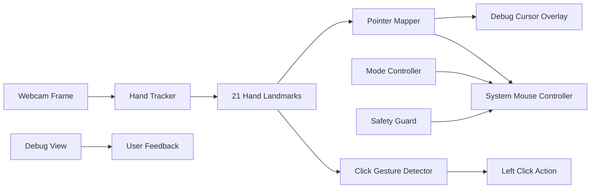

# HandMouse Prototype Design

Date: 2026-06-06
Status: Draft for implementation planning

## Goal

Build a Windows-native Python technical prototype that uses a webcam to control the mouse with hand gestures.

The first version focuses on proving the core interaction loop:

- Move the cursor with the index finger.
- Trigger a left click by pinching thumb and index finger.
- Run safely in a debug-first mode before enabling real system mouse control.
- Show enough visual telemetry to tune movement stability and click accuracy.

## Non-Goals

- No right click, drag, scrolling, or custom gesture configuration in version 1.
- No desktop GUI, tray app, installer, or background service.
- No model training or custom gesture classifier.
- No attempt to fully replace a physical mouse in version 1.

## Target Platform

- OS: Windows
- Runtime: Python
- Input: local webcam
- Mouse control: `pyautogui` first, with `pynput` as a possible fallback if needed
- Hand tracking: MediaPipe Hands
- Video processing and debug window: OpenCV

## High-Level Architecture



## Module Boundaries

The prototype should be small, but not a single tangled script. The recommended module layout is:

- `app.py`: application loop, startup, keyboard handling, and component wiring.
- `camera.py`: webcam open/read/release logic.
- `hand_tracker.py`: MediaPipe setup and conversion from frames to hand landmarks.
- `pointer_mapper.py`: maps index fingertip position from camera coordinates to screen coordinates with smoothing.
- `gesture_detector.py`: detects thumb-index pinch and emits click events with debouncing.
- `mouse_controller.py`: abstracts real mouse movement/clicking and debug-only mode.
- `debug_view.py`: draws camera frame overlays, control region, landmarks, target point, FPS, mode, and pinch distance.
- `config.py`: constants for camera size, control region, smoothing, pinch threshold, click cooldown, and failsafe behavior.

Each module should have one job and expose a small interface so later versions can add right click, drag, scrolling, or configuration without rewriting the core loop.

## Interaction Modes

The app starts in debug mode.

- Debug mode: hand tracking and cursor target are shown in the OpenCV window, but the system mouse is not moved.
- Control mode: the mapped hand position controls the real system mouse, and pinch emits real left clicks.
- Press `m` to toggle debug/control mode.
- Press `q` to quit.
- Keep PyAutoGUI failsafe enabled so moving the real mouse to the screen corner can abort if control becomes unstable.

## Gesture Model

Version 1 uses simple geometry instead of trained classification.

```mermaid
stateDiagram-v2
  [*] --> NoHand
  NoHand --> Tracking: hand detected
  Tracking --> Moving: index fingertip valid
  Moving --> PinchCandidate: thumb-index distance below threshold
  PinchCandidate --> Click: pinch held for minimum duration
  Click --> Cooldown: emit left click
  Cooldown --> Moving: cooldown elapsed and pinch released
  Moving --> NoHand: hand lost
  PinchCandidate --> Moving: pinch released too early
```

The click detector should use three protections:

- Minimum pinch-hold duration before click.
- Cooldown after a click.
- Release requirement before the next click.

## Pointer Mapping

The pointer mapper should:

- Use the index fingertip landmark as the target.
- Define a camera control rectangle instead of using the full frame edges.
- Map that rectangle to the full screen.
- Smooth movement using an exponential moving average.
- Optionally ignore very small movements with a dead zone.

This keeps cursor movement stable and reduces edge jitter.

## Debug Visualization

The debug window should show:

- Webcam frame.
- MediaPipe hand landmarks.
- Control rectangle.
- Raw index fingertip point.
- Smoothed target point.
- Current mode: `DEBUG` or `CONTROL`.
- Current gesture state: `MOVING`, `PINCH_CANDIDATE`, `CLICK`, `COOLDOWN`.
- FPS.
- Thumb-index pinch distance.

This is required for tuning. Without it, click threshold and movement smoothing become guesswork.

## Safety Rules

- Start in debug mode, never in real control mode.
- `m` toggles real control.
- `q` exits immediately.
- PyAutoGUI failsafe stays enabled.
- If the hand is lost, stop issuing mouse movement and click events.
- If multiple hands are detected, version 1 should use the first confident hand only and display that decision.

## Implementation Approach

Use the small-module prototype approach:

1. Create project skeleton and dependency files.
2. Implement camera capture and debug window.
3. Add MediaPipe hand tracking.
4. Add pointer mapping in debug mode.
5. Add real mouse movement behind the `m` mode toggle.
6. Add pinch left-click detection with debouncing.
7. Tune thresholds using the enhanced debug overlay.

## Validation Criteria

The prototype is considered successful when:

- App starts on Windows with one command.
- Webcam feed appears with hand landmarks.
- Debug mode shows a stable mapped cursor target.
- Pressing `m` enables real cursor movement.
- Thumb-index pinch triggers a left click once, not repeatedly.
- Pressing `q` exits cleanly.
- Losing the hand does not cause random clicks or jumps.

## Open Questions for Later Versions

- Should right click be thumb-middle pinch or a different hand pose?
- Should drag be long pinch hold or separate mode?
- Should control mode require a hold-to-enable hotkey for safer daily use?
- Should the app support per-user calibration and saved thresholds?
- Should a future version use a trained classifier from `kinivi/hand-gesture-recognition-mediapipe` style examples?
