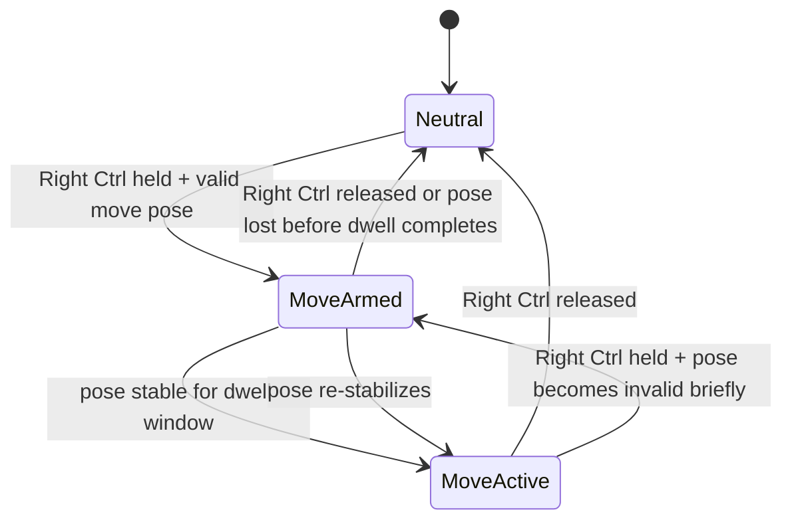

# HandMouse Right Ctrl Hold-to-Move Design

Date: 2026-06-08
Status: Implemented and validated after user testing

## Goal

Reduce the current false-trigger rate by separating pointer movement from click and grab behavior.

This design only changes the movement interaction:

- Holding `Right Ctrl` becomes the explicit clutch for mouse movement.
- While `Right Ctrl` is held, the system may enter movement mode if a valid move pose is visible.
- While movement mode is active, click, grab-scroll, and swipe shortcuts are disabled.
- Releasing `Right Ctrl` exits movement mode immediately, without depending on pose transitions.

The purpose is to stop the current failure mode seen in testing videos: the cursor continues moving while the user is trying to perform a click gesture.

## Non-Goals

- This design does not solve the final click gesture design.
- This design does not redesign grab-scroll interaction yet.
- This design does not introduce a full multi-mode gesture vocabulary in one pass.
- This design does not require background UI, tray integration, or installer work.

## Problem Statement

The current interaction model allows pointer movement and gesture recognition to run in overlapping time windows. In practice this causes two visible failures:

1. During click attempts, the pointer still moves because the hand must physically reposition to form the pinch.
2. During pose transitions, intermediate hand shapes can be misread as competing gestures.

The root issue is not just threshold tuning. The problem is that movement currently behaves like a continuously active channel instead of an explicitly gated mode.

## Design Summary

Introduce an explicit movement clutch:

- `Right Ctrl` is the movement enable key in the validated implementation.
- Movement is permitted only while `Right Ctrl` is physically held down.
- Movement uses a dedicated move pose.
- Pointer updates are ignored when `Right Ctrl` is not held.
- Gesture detectors that can conflict with movement are suppressed while `Right Ctrl` is held and movement is active.

This turns movement into an intentional, temporary mode rather than the default interpretation of any valid hand.

## Why Right Ctrl

Initial design work used `F8`, but validation on the target machine showed that `Right Ctrl` is the more usable clutch key in practice:

- it feels more natural to hold continuously during movement,
- it behaved more smoothly than `F8` during live testing,
- once the listener was changed to suppress and track the key at the Windows hook layer, the foreground-app leakage problem became manageable.

This design assumes the implementation will move from OpenCV window-local key reads toward a global Windows key listener. Otherwise the clutch only works while the debug window has focus, which is not acceptable for real use.

## Interaction Model

### Neutral

Default state when `Right Ctrl` is not held.

- No real pointer movement.
- No entry into movement mode.
- Debug overlay may still display landmarks and telemetry.
- Click and grab logic remain out of scope for this design and should not be made more permissive here.

### Move Armed

Intermediate state entered when `Right Ctrl` is held and a valid move pose is detected.

- Requires a short stability window before enabling real pointer movement.
- Recommended dwell: `120-200 ms`.
- This filters accidental brush-through poses when the user first raises their hand.

### Move Active

Entered after `Right Ctrl` is held and the move pose stays stable through the arming window.

- Pointer movement is enabled.
- Click, grab-scroll, and swipe actions are disabled.
- Pointer updates continue only while `Right Ctrl` remains held.
- Releasing `Right Ctrl` exits immediately to `Neutral`.

The move pose itself may drift slightly during motion; the system should not require the user to perfectly freeze the pose once active. The exit condition is key release, not pose disappearance.

## State Machine

Notes:

- `Right Ctrl released` is the authoritative exit path.
- Brief pose instability while `Right Ctrl` is still held should not immediately trigger click or grab. It should either stay in `MoveActive` with movement paused briefly, or fall back to `MoveArmed`.
- No other gesture mode may activate during `MoveArmed` or `MoveActive`.

## Move Pose

For this design, the move pose should be treated as a dedicated recognizer, not as a generic “hand present” condition.

Current preferred direction:

- two-finger move pose using index + middle finger extended,
- other fingers folded enough to distinguish it from open-palm and grab-like poses.

This is not selected because it is inherently perfect. It is selected because it is explicit enough to serve as a gated mode entry signal once paired with the clutch key.

The important design rule is:

- the move pose is used to authorize entry into movement mode,
- `Right Ctrl` is used to hold the mode open,
- mode exit is controlled by `Right Ctrl` release, not by waiting for the pose to fully disappear.

## Pointer Behavior Inside Move Active

While in `MoveActive`:

- only the pointer engine may emit OS mouse movement,
- pinch click detector must be fed neutral input,
- grab-scroll detector must not emit scroll actions,
- shortcut detector must be reset or ignored.

This must be enforced at the application loop level, not just by hoping detector thresholds do not overlap.

## Key Handling Requirements

The current `cv2.waitKey()` approach is insufficient for this design because it depends on the OpenCV window having focus.

Implementation requirements:

- use a Windows-capable global key listener,
- track `Right Ctrl` press and release transitions,
- keep the clutch key private to the app as much as possible,
- make failure behavior obvious in debug output if the listener is unavailable.

If global key capture cannot be established reliably, this design should not be presented as production-ready.

## Debug Overlay Changes

Add explicit movement-clutch visibility:

- `Clutch: UP/DOWN`
- `Move mode: NEUTRAL / ARMED / ACTIVE`
- `Move pose: yes/no`

This is required because debugging ambiguous gesture systems without state telemetry is too slow.

## Safety Rules

- App still starts non-moving.
- `Right Ctrl` release must always stop movement immediately.
- If the hand is lost during `MoveActive`, movement stops but the system must not reinterpret that transition as click or grab.
- PyAutoGUI failsafe behavior remains enabled.

## Validation Criteria

This design is successful when:

- holding `Right Ctrl` and showing the move pose enables movement,
- releasing `Right Ctrl` stops movement immediately,
- attempting a click while not holding `Right Ctrl` no longer causes concurrent pointer drift from the movement channel,
- movement mode does not emit click, scroll, or swipe actions,
- the feature works while another foreground application has focus.

## Follow-Up Work

After this design is implemented and tested, the next design decision should be whether click and grab also become explicit clutch-based exclusive modes, or whether only movement needs a clutch while the others remain pose-driven.
